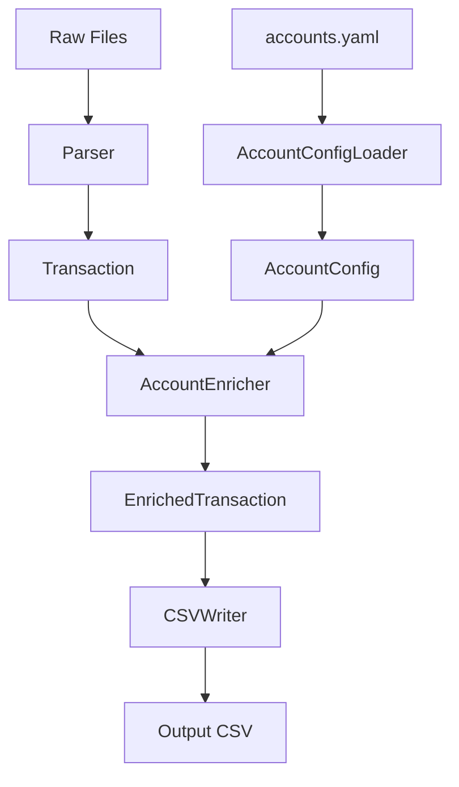

# Design Document: Account Configuration

## Overview

This design introduces an account configuration system that enriches transaction data with human-readable account names and account types during CSV export. The system reads configuration from a centralized `accounts.yaml` file in the `raw/` directory and applies it during the transaction processing pipeline.

## Architecture



The account configuration system integrates into the existing parsing pipeline:
1. `AccountConfigLoader` loads and validates `accounts.yaml` at startup
2. `AccountEnricher` enriches transactions with account metadata before CSV export
3. `CSVWriter` outputs the enriched data with new columns

## Components and Interfaces

### AccountConfig (Data Model)

```python
@dataclass
class AccountConfig:
    """Configuration for a single account"""
    account_id: str
    institution: str
    account_name: str
    account_type: str  # "debit" or "credit"
    description: Optional[str] = None
```

### AccountConfigLoader

```python
class AccountConfigLoader:
    """Loads and validates account configuration from YAML file"""
    
    def __init__(self, config_path: str = "raw/accounts.yaml"):
        self.config_path = config_path
        self._accounts: Dict[Tuple[str, str], AccountConfig] = {}
    
    def load(self) -> bool:
        """Load configuration from file. Returns True if successful."""
        pass
    
    def get_account(self, institution: str, account_id: str) -> Optional[AccountConfig]:
        """Get account config by institution and account_id"""
        pass
    
    def get_all_accounts(self) -> List[AccountConfig]:
        """Get all configured accounts"""
        pass
```

### AccountEnricher

```python
class AccountEnricher:
    """Enriches transactions with account configuration data"""
    
    def __init__(self, config_loader: AccountConfigLoader):
        self.config_loader = config_loader
    
    def enrich(self, transaction: Transaction) -> EnrichedTransaction:
        """Add account_name and account_type to transaction"""
        pass
    
    def enrich_batch(self, transactions: List[Transaction]) -> List[EnrichedTransaction]:
        """Enrich multiple transactions"""
        pass
```

### AccountTemplateGenerator

```python
class AccountTemplateGenerator:
    """Generates sample accounts.yaml template with documentation"""
    
    DEFAULT_OUTPUT_PATH = "raw/accounts.yaml.example"
    
    @staticmethod
    def generate(output_path: str = DEFAULT_OUTPUT_PATH) -> str:
        """
        Generate a sample accounts.yaml template file.
        
        Returns the path to the generated file.
        Includes:
        - Examples for multiple institutions (firsttech, chase)
        - Comments explaining each configuration option
        - All supported properties (account_name, account_type, description)
        """
        pass
```

**Design Decision**: The template generator is implemented as a static utility class rather than integrated into AccountConfigLoader. This keeps concerns separated—loading/validation vs. documentation generation—and allows the CLI to invoke template generation without instantiating the full config loading infrastructure.

### EnrichedTransaction (Data Model)

```python
@dataclass
class EnrichedTransaction:
    """Transaction with account configuration applied"""
    date: datetime
    amount: Decimal
    description: str
    account: str
    institution: str
    transaction_id: Optional[str] = None
    category: Optional[str] = None
    balance: Optional[Decimal] = None
    account_name: str = ""
    account_type: str = "debit"
```

## Data Models

### accounts.yaml Schema

```yaml
# Institution name (lowercase, matches folder name in raw/)
<institution>:
  # Account ID (last 4 digits or unique identifier from source file)
  "<account_id>":
    account_name: "<human readable name>"  # Required
    account_type: "<debit|credit>"          # Required
    description: "<optional notes>"         # Optional
```

### Example Configuration

```yaml
# First Tech Federal Credit Union accounts
firsttech:
  "0125":
    account_name: "Primary Savings"
    account_type: debit
    description: "Emergency fund"
  "0547":
    account_name: "Main Checking"
    account_type: debit
  "0854":
    account_name: "Joint Savings"
    account_type: debit

# Chase accounts
chase:
  "4521":
    account_name: "Sapphire Preferred"
    account_type: credit
    description: "Travel rewards card"
```

### CSV Output Schema

Existing columns remain unchanged. New columns added after `account`:

| Column | Type | Description |
|--------|------|-------------|
| date | date | Transaction date |
| amount | decimal | Transaction amount |
| description | string | Transaction description |
| account | string | Raw account ID |
| **account_name** | string | Human-readable account name |
| **account_type** | string | "debit" or "credit" |
| institution | string | Institution name |
| transaction_id | string | Unique transaction ID |
| category | string | Transaction category |
| balance | decimal | Account balance |

## Correctness Properties

*A property is a characteristic or behavior that should hold true across all valid executions of a system—essentially, a formal statement about what the system should do. Properties serve as the bridge between human-readable specifications and machine-verifiable correctness guarantees.*

### Property 1: Configuration Round-Trip

*For any* valid AccountConfig object, serializing it to YAML and then parsing it back should produce an equivalent AccountConfig object.

**Validates: Requirements 1.1, 2.1**

### Property 2: Config Validation Completeness

*For any* account configuration entry, if it is missing `account_name` or has an invalid `account_type`, the system should either reject it or apply documented defaults (empty string for missing name is invalid, "debit" for invalid type).

**Validates: Requirements 2.2, 2.3, 2.4**

### Property 3: Transaction Enrichment Correctness

*For any* transaction and account configuration, if the transaction's (institution, account_id) pair matches a configured account, the enriched transaction should contain exactly the configured account_name and account_type.

**Validates: Requirements 3.1, 3.2, 3.4**

### Property 4: Unconfigured Account Defaults

*For any* transaction whose (institution, account_id) pair does not match any configured account, the enriched transaction should have account_name equal to the raw account_id and account_type equal to "debit".

**Validates: Requirements 3.3**

### Property 5: CSV Column Preservation

*For any* list of transactions, the CSV output should contain all original columns in their original order, with the new columns (account_name, account_type) inserted after the `account` column.

**Validates: Requirements 4.3, 4.4**

### Property 6: Multi-Institution Isolation

*For any* two accounts with the same account_id but different institutions, the system should correctly distinguish them and apply the correct configuration to each.

**Validates: Requirements 1.4, 3.4**

## CLI Integration

### Template Generation Command

```bash
python -m kiro_budget.cli generate-accounts-template [--output PATH]
```

**Options**:
- `--output, -o`: Output path for template file (default: `raw/accounts.yaml.example`)

**Behavior**:
- Creates a sample `accounts.yaml` template with commented examples
- Includes examples for multiple institutions (firsttech, chase)
- Documents all configuration options inline
- Does not overwrite existing files without confirmation

**Design Decision**: The template is generated to `.example` extension by default to avoid accidentally overwriting user configurations. Users copy and rename to `accounts.yaml` after customization.

## Error Handling

| Error Condition | Behavior |
|-----------------|----------|
| accounts.yaml not found | Log info, continue with defaults |
| Invalid YAML syntax | Log error, continue with defaults |
| Missing account_name | Log warning, skip account entry |
| Invalid account_type | Log warning, default to "debit" |
| Missing institution section | Treat as no accounts for that institution |

## Testing Strategy

### Unit Tests
- AccountConfigLoader: file reading, YAML parsing, validation
- AccountEnricher: enrichment logic, default handling
- Integration with CSVWriter

### Property-Based Tests
- Use `hypothesis` library for Python property-based testing
- Minimum 100 iterations per property test
- Generate random valid/invalid configurations
- Generate random transactions with various account_id patterns

### Test Configuration
```python
from hypothesis import given, settings
from hypothesis import strategies as st

@settings(max_examples=100)
@given(...)
def test_property_name():
    # Property test implementation
    pass
```
