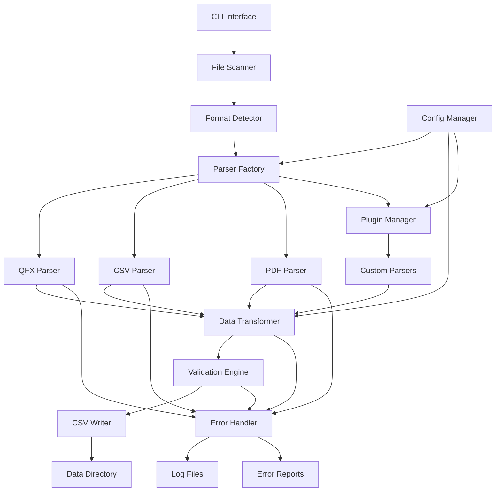

# Design Document: Financial Data Parser

## Overview

The Financial Data Parser is a modular Python system that converts various financial data formats (QFX, OFX, CSV, PDF) into a unified CSV format. The system follows a plugin-based architecture where each file format has its own specialized parser, all outputting to a common data structure.

The parser processes files from the `raw/` directory and subfolders, then outputs standardized CSV files to the `data/` directory, organized by financial institution. The design emphasizes robustness, extensibility, and data validation.

## Architecture

The system uses a layered architecture with clear separation of concerns:



### Core Components

1. **File Scanner**: Recursively scans the raw directory for supported file types
2. **Format Detector**: Identifies file format based on extension and content analysis
3. **Parser Factory**: Creates appropriate parser instances based on detected format
4. **Format-Specific Parsers**: Handle the parsing logic for each supported format
5. **Plugin Manager**: Loads and manages custom parser plugins for extensibility
6. **Data Transformer**: Converts parsed data to the unified format
7. **Validation Engine**: Validates transaction data and performs deduplication
8. **CSV Writer**: Outputs standardized CSV files with consistent naming
9. **Error Handler**: Manages logging and error reporting throughout the process
10. **CLI Interface**: Provides command-line interface for batch processing
11. **Config Manager**: Handles configuration loading and institution-specific rules

## Components and Interfaces

### Core Interfaces

```python
from abc import ABC, abstractmethod
from typing import List, Dict, Any, Optional
from dataclasses import dataclass
from datetime import datetime
from decimal import Decimal

@dataclass
class Transaction:
    """Unified transaction data structure"""
    date: datetime
    amount: Decimal
    description: str
    account: str
    institution: str
    transaction_id: Optional[str] = None
    category: Optional[str] = None
    balance: Optional[Decimal] = None

class FileParser(ABC):
    """Abstract base class for all file parsers"""
    
    @abstractmethod
    def parse(self, file_path: str) -> List[Transaction]:
        """Parse the file and return list of transactions"""
        pass
    
    @abstractmethod
    def get_supported_extensions(self) -> List[str]:
        """Return list of supported file extensions"""
        pass
    
    @abstractmethod
    def validate_file(self, file_path: str) -> bool:
        """Validate if file can be processed by this parser"""
        pass

class DataTransformer:
    """Transforms parsed data to unified format"""
    
    def __init__(self, config: ParserConfig):
        self.config = config
    
    def normalize_date(self, date_str: str, formats: List[str] = None) -> datetime:
        """Convert various date formats to datetime"""
        pass
    
    def normalize_amount(self, amount_str: str) -> Decimal:
        """Convert various amount formats to Decimal"""
        pass
    
    def clean_description(self, description: str) -> str:
        """Clean and standardize transaction descriptions"""
        pass
    
    def extract_institution(self, file_path: str) -> str:
        """Extract institution name from file path or configuration"""
        pass
    
    def extract_account(self, file_path: str, transaction_data: Dict) -> str:
        """Extract account identifier from file path or transaction data"""
        pass

class ValidationEngine:
    """Validates parsed transaction data"""
    
    def validate_transaction(self, transaction: Transaction) -> List[str]:
        """Validate individual transaction and return list of errors"""
        pass
    
    def validate_csv_output(self, csv_path: str) -> List[str]:
        """Validate generated CSV file for data integrity"""
        pass
    
    def deduplicate_transactions(self, transactions: List[Transaction]) -> List[Transaction]:
        """Remove duplicate transactions based on transaction_id and date"""
        pass
```

### QFX/OFX Parser Implementation

```python
class QFXParser(FileParser):
    """Parser for QFX and OFX files using ofxparse library"""
    
    def __init__(self, config: ParserConfig):
        self.supported_extensions = ['.qfx', '.ofx']
        self.config = config
    
    def parse(self, file_path: str) -> List[Transaction]:
        """Parse QFX/OFX file using ofxparse library"""
        # Implementation uses ofxparse to extract transactions
        # Maps OFX fields to Transaction dataclass
        # Handles malformed data gracefully
        pass
    
    def validate_file(self, file_path: str) -> bool:
        """Validate QFX/OFX file format"""
        pass
    
    def extract_account_info(self, ofx_data) -> Dict[str, str]:
        """Extract account information from OFX data"""
        pass
```

### CSV Parser Implementation

```python
class CSVParser(FileParser):
    """Parser for CSV files with automatic column mapping"""
    
    def __init__(self, config: ParserConfig):
        self.supported_extensions = ['.csv']
        self.config = config
        self.column_mappings = {
            # Common column name variations
            'date': ['date', 'transaction_date', 'posting_date', 'Date', 'Transaction Date'],
            'amount': ['amount', 'Amount', 'transaction_amount', 'debit_credit', 'Debit', 'Credit'],
            'description': ['description', 'Description', 'memo', 'details', 'Memo', 'Details']
        }
    
    def parse(self, file_path: str) -> List[Transaction]:
        """Parse CSV file with automatic column detection"""
        # Implementation uses pandas to read CSV
        # Maps columns based on header analysis
        # Prompts for manual mapping if unknown format detected
        pass
    
    def detect_column_mapping(self, headers: List[str]) -> Dict[str, str]:
        """Automatically detect column mappings or prompt for manual configuration"""
        pass
```

### PDF Parser Implementation

```python
class PDFParser(FileParser):
    """Parser for PDF statements using pdfplumber"""
    
    def __init__(self, config: ParserConfig):
        self.supported_extensions = ['.pdf']
        self.config = config
    
    def parse(self, file_path: str) -> List[Transaction]:
        """Parse PDF file using pdfplumber for table extraction"""
        # Implementation uses pdfplumber to extract tables
        # Identifies transaction patterns in extracted text
        # Handles multi-page documents
        pass
    
    def validate_file(self, file_path: str) -> bool:
        """Validate PDF file can be processed"""
        pass
    
    def extract_tables_from_all_pages(self, pdf_path: str) -> List[List[Dict]]:
        """Extract transaction tables from all pages of PDF"""
        pass
    
    def identify_transaction_patterns(self, text_data: str) -> List[Dict]:
        """Identify and extract transaction patterns from text"""
        pass
```

### Plugin Architecture

```python
class ParserPlugin(ABC):
    """Base class for parser plugins"""
    
    @abstractmethod
    def get_name(self) -> str:
        """Return plugin name"""
        pass
    
    @abstractmethod
    def get_parser_class(self) -> type:
        """Return the parser class this plugin provides"""
        pass
    
    @abstractmethod
    def get_supported_institutions(self) -> List[str]:
        """Return list of institutions this plugin supports"""
        pass

class PluginManager:
    """Manages loading and registration of parser plugins"""
    
    def __init__(self, config: ParserConfig):
        self.config = config
        self.registered_parsers: Dict[str, FileParser] = {}
        self.registered_plugins: Dict[str, ParserPlugin] = {}
    
    def load_plugins(self) -> None:
        """Load plugins from configured directories"""
        pass
    
    def register_parser(self, name: str, parser_class: type) -> None:
        """Register a new parser type"""
        pass
    
    def get_parser_for_file(self, file_path: str) -> Optional[FileParser]:
        """Get appropriate parser for a file"""
        pass

class CommandLineInterface:
    """Command-line interface for the parser"""
    
    def __init__(self):
        self.config = ParserConfig()
    
    def parse_arguments(self, args: List[str]) -> Dict[str, Any]:
        """Parse command-line arguments"""
        pass
    
    def run_parser(self, target_files: List[str] = None, target_dirs: List[str] = None) -> None:
        """Run parser on specified files or directories"""
        pass
    
    def generate_config_template(self, output_path: str) -> None:
        """Generate configuration file template"""
        pass
```

## Data Models

### Transaction Data Structure

The unified transaction format includes these fields:

- **date**: ISO 8601 formatted date (YYYY-MM-DD)
- **amount**: Decimal with two decimal places (positive for credits, negative for debits)
- **description**: Cleaned transaction description
- **account**: Account identifier (last 4 digits or account name)
- **institution**: Financial institution name (derived from file path or configuration)
- **transaction_id**: Unique transaction identifier when available
- **category**: Transaction category (optional, for future categorization features)
- **balance**: Account balance after transaction (when available)

### File Processing Metadata

```python
@dataclass
class ProcessingResult:
    """Result of file processing operation"""
    file_path: str
    institution: str
    transactions_count: int
    output_file: str
    processing_time: float
    errors: List[str]
    warnings: List[str]
    success: bool
```

### Configuration Structure

```python
@dataclass
class ParserConfig:
    """Configuration for parser behavior"""
    raw_directory: str = "raw"
    data_directory: str = "data"
    skip_processed: bool = True
    force_reprocess: bool = False
    date_formats: List[str] = None
    institution_mappings: Dict[str, str] = None
    column_mappings: Dict[str, Dict[str, List[str]]] = None
    output_filename_pattern: str = "{institution}_{account}_{start_date}_{end_date}.csv"
    plugin_directories: List[str] = None
    
    def __post_init__(self):
        if self.date_formats is None:
            self.date_formats = [
                "%Y-%m-%d", "%m/%d/%Y", "%d/%m/%Y", 
                "%Y-%m-%d %H:%M:%S", "%m/%d/%Y %H:%M:%S"
            ]
        if self.institution_mappings is None:
            self.institution_mappings = {}
        if self.column_mappings is None:
            self.column_mappings = {}
        if self.plugin_directories is None:
            self.plugin_directories = []

@dataclass
class InstitutionConfig:
    """Institution-specific parsing configuration"""
    name: str
    parser_type: str
    column_mappings: Dict[str, str]
    date_format: str
    amount_format: str
    account_extraction_pattern: str
    custom_rules: Dict[str, Any] = None
```

## Correctness Properties

*A property is a characteristic or behavior that should hold true across all valid executions of a system-essentially, a formal statement about what the system should do. Properties serve as the bridge between human-readable specifications and machine-verifiable correctness guarantees.*

Based on the prework analysis, I've identified several key properties that can be tested. After reviewing for redundancy, I've consolidated related properties to avoid duplication while maintaining comprehensive coverage.

### Property 1: Complete Transaction Extraction
*For any* valid financial data file (QFX, CSV, or PDF), parsing should extract all transaction records without loss, meaning the count of transactions in the output should match the count of transactions in the input file.
**Validates: Requirements 1.1, 3.1**

### Property 2: Required Field Preservation
*For any* parsed transaction, all required fields (date, amount, description, account, institution, transaction_id, category, balance) should be present and non-empty in the output where data is available in the source.
**Validates: Requirements 1.2**

### Property 3: Error Resilience
*For any* file containing both valid and malformed transaction records, parsing should extract all valid records while logging errors for malformed ones, ensuring valid data is not lost due to partial corruption.
**Validates: Requirements 1.3, 6.1, 6.2**

### Property 4: Output Format Consistency
*For any* successfully parsed file, the output CSV should conform to the unified schema with exactly these columns: date, amount, description, account, institution, transaction_id, category, balance.
**Validates: Requirements 1.4, 2.4, 3.4, 4.1**

### Property 5: Data Precision Preservation
*For any* transaction with monetary amounts, the parsed amount should preserve the original precision without rounding errors or data loss.
**Validates: Requirements 1.5**

### Property 6: Column Mapping Consistency
*For any* CSV file with recognizable column headers, the parser should correctly map columns to the unified format based on common naming patterns.
**Validates: Requirements 2.1, 2.2**

### Property 7: Format Normalization
*For any* input file containing dates or currency amounts in various formats, the output should normalize all dates to ISO 8601 format (YYYY-MM-DD) and all amounts to decimal format with two decimal places.
**Validates: Requirements 2.5, 4.2, 4.3**

### Property 8: Multi-page Processing
*For any* multi-page PDF statement, parsing should extract transactions from all pages, not just the first page.
**Validates: Requirements 3.5**

### Property 9: CSV Structure Compliance
*For any* generated CSV output file, the first row should contain the standard headers and all subsequent rows should have the same number of columns.
**Validates: Requirements 4.4**

### Property 10: Unique Filename Generation
*For any* set of processed files from the same account, the generated output filenames should be unique and follow the configured pattern.
**Validates: Requirements 4.5**

### Property 11: Recursive Directory Scanning
*For any* directory structure containing supported file types, the parser should discover all files regardless of subdirectory depth.
**Validates: Requirements 5.1**

### Property 12: Output Organization
*For any* processed files, the output should be organized by institution in the data directory structure.
**Validates: Requirements 5.2**

### Property 13: Duplicate Processing Prevention
*For any* file that has been previously processed, running the parser again should skip the file unless explicitly forced to reprocess.
**Validates: Requirements 5.3**

### Property 14: Processing Summary Generation
*For any* parser execution, a summary report should be generated containing the count of processed files, successful parses, errors, and processing time.
**Validates: Requirements 5.4**

### Property 15: Directory Creation
*For any* specified output directory that doesn't exist, the parser should create the necessary directory structure before writing files.
**Validates: Requirements 5.5**

### Property 16: Transaction Deduplication
*For any* file containing duplicate transactions (same transaction_id and date), the parser should output only unique transactions.
**Validates: Requirements 6.3**

### Property 17: Output Validation
*For any* generated CSV file, the data should pass integrity checks including valid dates, numeric amounts, and required field presence.
**Validates: Requirements 6.4**

### Property 18: Error Report Generation
*For any* parser execution that encounters errors, an error report should be generated listing all issues with file names and details.
**Validates: Requirements 6.5**

### Property 19: Unrecognizable Format Handling
*For any* PDF file with unrecognizable transaction patterns, the parser should log the issue and skip the file without crashing.
**Validates: Requirements 3.3**

### Property 20: Command-line Interface
*For any* valid command-line arguments specifying files or directories, the parser should process only the specified targets.
**Validates: Requirements 7.4**

### Property 21: Configuration Flexibility
*For any* configuration specifying custom output directories or filename patterns, the parser should respect those settings.
**Validates: Requirements 7.5**

### Property 22: Configuration Support
*For any* valid configuration file specifying institution-specific parsing rules, the parser should apply those rules when processing files from that institution.
**Validates: Requirements 7.1**

### Property 23: Default Rule Fallback
*For any* file from an unknown institution, the parser should use default parsing rules and log warnings about the unknown institution.
**Validates: Requirements 7.3**

## Error Handling

The system implements comprehensive error handling at multiple levels to ensure robust processing and detailed error reporting:

### File-Level Error Handling
- **Invalid file formats**: Log error with file path and skip file, continue processing other files
- **Corrupted files**: Attempt partial recovery, log corruption details with line numbers
- **Permission errors**: Log access issues with specific permissions needed and skip file
- **Missing files**: Log missing file warnings for expected files in directory structure
- **Unsupported formats**: Log format detection failure and suggest supported alternatives

### Record-Level Error Handling
- **Malformed transactions**: Skip individual records, log specific parsing errors with line numbers
- **Missing required fields**: Skip record with detailed field-missing logs and field requirements
- **Invalid data types**: Attempt type conversion with multiple strategies, skip if impossible
- **Date parsing errors**: Try multiple date formats from configuration, log all attempted formats
- **Amount parsing errors**: Handle various currency formats, negative indicators, and decimal separators

### Validation and Data Quality
- **Duplicate detection**: Identify duplicates based on transaction_id and date, log deduplication actions
- **Data integrity checks**: Validate required fields, data types, and value ranges
- **Cross-field validation**: Ensure consistency between related fields (e.g., balance calculations)
- **Institution-specific validation**: Apply custom validation rules based on institution configuration

### System-Level Error Handling
- **Directory access errors**: Create directories if possible, fail gracefully with clear messages if not
- **Disk space issues**: Check available space before writing large files, warn when space is low
- **Memory constraints**: Process files in chunks for large datasets, monitor memory usage
- **Configuration errors**: Use defaults with warnings for invalid config, validate config on startup
- **Plugin loading errors**: Log plugin failures, continue with built-in parsers

### Error Reporting and Logging
- **Structured logging**: JSON-formatted logs with timestamps, severity, file context, and error codes
- **Error aggregation**: Summary reports showing error patterns, frequencies, and affected files
- **User-friendly messages**: Clear error descriptions for common issues with suggested solutions
- **Debug information**: Detailed technical information for troubleshooting and development
- **Error reports**: Generate comprehensive error reports listing all issues encountered during processing
- **Progress tracking**: Report processing progress and estimated completion times for large batches

## Testing Strategy

The testing strategy employs a dual approach combining unit tests for specific scenarios and property-based tests for comprehensive coverage.

### Property-Based Testing
Property-based testing will be implemented using the **Hypothesis** library for Python, which excels at generating diverse test inputs and finding edge cases.

**Configuration**:
- Minimum 100 iterations per property test
- Each property test references its corresponding design document property
- Tag format: **Feature: financial-data-parser, Property {number}: {property_text}**

**Key Property Test Areas**:
- **Data integrity**: Round-trip properties for parsing and serialization
- **Format compliance**: Output format validation across all input types
- **Error resilience**: Partial corruption handling and recovery
- **Boundary conditions**: Empty files, single records, maximum file sizes

### Unit Testing
Unit tests will focus on specific examples, edge cases, and integration points using **pytest**.

**Test Categories**:
- **Parser-specific tests**: Individual format parser validation
- **Integration tests**: End-to-end processing workflows
- **Configuration tests**: Various configuration scenarios
- **Error condition tests**: Specific error scenarios and recovery

**Test Organization**:
- `tests/parsers/` - Format-specific parser tests
- `tests/integration/` - End-to-end workflow tests
- `tests/utils/` - Utility function tests
- `tests/fixtures/` - Sample data files for testing

### Test Data Management
- **Synthetic data generation**: Create test files programmatically
- **Real data samples**: Anonymized samples from actual financial institutions
- **Edge case files**: Manually crafted files for specific error conditions
- **Performance test data**: Large files for performance validation

### Continuous Integration
- **Automated test execution**: Run all tests on code changes
- **Coverage reporting**: Maintain >90% code coverage
- **Performance benchmarks**: Track parsing performance over time
- **Regression testing**: Ensure new changes don't break existing functionality

## Implementation Dependencies

### Core Libraries
- **ofxparse** (>=0.21): QFX/OFX file parsing
- **pandas** (>=1.5.0): CSV processing and data manipulation
- **pdfplumber** (>=0.7.0): PDF table extraction
- **click** (>=8.0.0): Command-line interface
- **pydantic** (>=1.10.0): Data validation and settings management

### Development Dependencies
- **pytest** (>=7.0.0): Unit testing framework
- **hypothesis** (>=6.0.0): Property-based testing
- **pytest-cov** (>=4.0.0): Coverage reporting
- **black** (>=22.0.0): Code formatting
- **mypy** (>=1.0.0): Static type checking

### Optional Dependencies
- **tabula-py** (>=2.5.0): Alternative PDF parsing for complex tables
- **openpyxl** (>=3.0.0): Excel file support (future enhancement)
- **python-dateutil** (>=2.8.0): Enhanced date parsing capabilities

## Performance Considerations

### Memory Management
- **Streaming processing**: Process large files in chunks to avoid memory issues
- **Lazy loading**: Load file content only when needed
- **Memory monitoring**: Track memory usage during processing

### Processing Optimization
- **Parallel processing**: Process multiple files concurrently when possible
- **Caching**: Cache parsed results to avoid reprocessing unchanged files
- **Incremental processing**: Only process new or modified files

### Scalability
- **Batch processing**: Handle large numbers of files efficiently
- **Progress reporting**: Provide feedback during long-running operations
- **Resource limits**: Configurable limits for memory and processing time

This design provides a robust, extensible foundation for parsing various financial data formats while maintaining data integrity and providing comprehensive error handling.