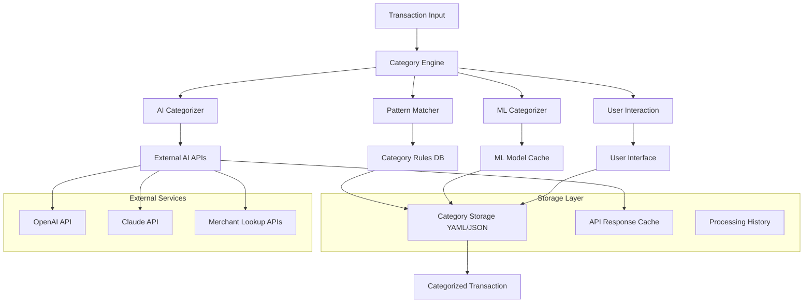

# Design Document: Transaction Categorization System

## Overview

The Transaction Categorization System is an intelligent financial data processing component that automatically assigns meaningful categories to financial transactions. The system employs a multi-layered approach combining pattern matching, AI-powered categorization, machine learning, and user feedback to achieve high accuracy while maintaining performance and cost efficiency.

The system integrates seamlessly with the existing kiro-budget infrastructure, enhancing the consolidated transaction data with category information that enables detailed spending analysis and budgeting insights.

## Architecture

### High-Level Architecture



### Processing Flow

The categorization process follows a hierarchical approach with fallback mechanisms:

1. **Pattern Matching (Primary)**: Fast, rule-based categorization using predefined patterns
2. **AI Categorization (Secondary)**: Intelligent categorization for unknown merchants using LLM APIs
3. **ML Prediction (Tertiary)**: Local machine learning model for offline categorization
4. **User Interaction (Fallback)**: Manual categorization with rule learning

## Components and Interfaces

### 1. Category Engine (`CategoryEngine`)

**Purpose**: Central orchestrator that coordinates all categorization methods and manages the decision logic.

**Key Methods**:
```python
class CategoryEngine:
    def categorize_transaction(self, transaction: Transaction) -> CategoryResult
    def batch_categorize(self, transactions: List[Transaction]) -> List[CategoryResult]
    def get_confidence_threshold(self) -> float
    def set_confidence_threshold(self, threshold: float) -> None
```

**Responsibilities**:
- Coordinate categorization attempts across different methods
- Apply confidence thresholds and fallback logic
- Manage caching and performance optimization
- Track categorization statistics and success rates

### 2. Pattern Matcher (`PatternMatcher`)

**Purpose**: Fast, rule-based categorization using merchant name patterns and regular expressions.

**Key Methods**:
```python
class PatternMatcher:
    def match_patterns(self, description: str) -> Optional[CategoryMatch]
    def add_pattern(self, category: str, pattern: str, confidence: float, specificity: str = "medium") -> None
    def load_patterns_from_config(self, config_path: str) -> None
    def get_matching_patterns(self, description: str) -> List[CategoryMatch]
    def calculate_specificity_score(self, pattern: str, description: str) -> float
    def resolve_pattern_conflicts(self, matches: List[CategoryMatch]) -> CategoryMatch
```

**Pattern Priority Logic**:
The system implements sophisticated pattern priority to handle cases like "COSTCO GAS":
- **Specificity Score**: Longer, more specific patterns get higher priority
- **Keyword Weighting**: Category-specific keywords (like "GAS") override general merchant names
- **Pattern Length**: "COSTCO GAS" (more specific) beats "COSTCO" (general)
- **Confidence Adjustment**: More specific matches get higher confidence scores

Example Priority Resolution:
```yaml
Gas:
  patterns:
    - pattern: ".*GAS.*"
      confidence: 0.90
      specificity: high
    - pattern: "COSTCO GAS"
      confidence: 0.95
      specificity: very_high

Groceries:
  patterns:
    - pattern: "COSTCO"
      confidence: 0.85
      specificity: medium
```

For "COSTCO GAS #1029":
1. Matches "COSTCO" → Groceries (confidence: 0.85, specificity: medium)
2. Matches ".*GAS.*" → Gas (confidence: 0.90, specificity: high)
3. Matches "COSTCO GAS" → Gas (confidence: 0.95, specificity: very_high)
4. **Result**: Gas category (highest specificity and confidence)

### 3. AI Categorizer (`AICategorizer`)

**Purpose**: Intelligent categorization using external AI APIs for complex or unknown merchant names.

**Key Methods**:
```python
class AICategorizer:
    def categorize_with_ai(self, description: str, amount: float) -> Optional[CategoryResult]
    def build_prompt(self, description: str, categories: List[str]) -> str
    def parse_ai_response(self, response: str) -> CategoryResult
    def get_cached_result(self, description: str) -> Optional[CategoryResult]
```

**AI Integration**:
- **OpenAI GPT**: Primary AI service for categorization
- **Claude**: Fallback AI service
- **Prompt Engineering**: Structured prompts with category constraints
- **Response Parsing**: Robust parsing of AI responses with validation

**Example Prompt Structure**:
```
Categorize this financial transaction:
Description: "COSTCO WHSE #1029"
Amount: $127.45

Available categories: [Groceries, Gas, Restaurants, Shopping, Utilities, ...]

Respond with only the most appropriate category name. If uncertain, respond with "Uncategorized".
```

### 4. ML Categorizer (`MLCategorizer`)

**Purpose**: Local machine learning model for offline categorization and learning from user patterns.

**Key Methods**:
```python
class MLCategorizer:
    def predict_category(self, features: TransactionFeatures) -> Optional[CategoryResult]
    def train_model(self, training_data: List[LabeledTransaction]) -> None
    def extract_features(self, transaction: Transaction) -> TransactionFeatures
    def update_with_feedback(self, transaction: Transaction, correct_category: str) -> None
```

**Feature Engineering**:
- **Text Features**: TF-IDF vectors from transaction descriptions
- **Amount Features**: Transaction amount, amount ranges, amount patterns
- **Temporal Features**: Day of week, time of day, seasonality
- **Account Features**: Account type, institution patterns

**Model Architecture**:
- **Primary Model**: Random Forest or XGBoost for robust classification
- **Text Processing**: Sentence transformers for semantic similarity
- **Incremental Learning**: Online learning capabilities for user feedback

### 5. Category Storage (`CategoryStorage`)

**Purpose**: Human-readable storage and management of category rules and configurations.

**Key Methods**:
```python
class CategoryStorage:
    def load_categories(self) -> CategoryConfig
    def save_categories(self, config: CategoryConfig) -> None
    def add_pattern_rule(self, category: str, pattern: str, confidence: float) -> None
    def backup_config(self) -> str
    def validate_config(self, config: CategoryConfig) -> ValidationResult
```

**Storage Format (YAML)**:
```yaml
# Transaction Category Configuration
version: "1.0"
default_category: "Uncategorized"
confidence_threshold: 0.7

categories:
  Groceries:
    patterns:
      - pattern: "COSTCO"
        confidence: 0.95
        type: "substring"
      - pattern: "FRED.MEYER"
        confidence: 0.90
        type: "substring"
    
  Restaurants:
    patterns:
      - pattern: ".*RESTAURANT.*"
        confidence: 0.85
        type: "regex"
      - pattern: "STARBUCKS"
        confidence: 0.95
        type: "substring"

  Gas:
    patterns:
      - pattern: ".*GAS.*"
        confidence: 0.85
        type: "regex"
        specificity: "high"
      - pattern: "COSTCO GAS"
        confidence: 0.95
        type: "substring"
        specificity: "very_high"
      - pattern: "SHELL"
        confidence: 0.90
        type: "substring"
        specificity: "high"

# AI Configuration
ai_config:
  enabled: true
  primary_service: "openai"
  fallback_service: "claude"
  cache_responses: true
  max_cost_per_month: 50.0

# ML Configuration  
ml_config:
  enabled: true
  model_type: "random_forest"
  retrain_threshold: 100
  confidence_threshold: 0.6
```

### 6. User Interaction (`UserInteraction`)

**Purpose**: Handle manual categorization requests and learn from user feedback.

**Key Methods**:
```python
class UserInteraction:
    def request_manual_categorization(self, transaction: Transaction) -> str
    def display_categorization_options(self, suggestions: List[str]) -> str
    def learn_from_feedback(self, transaction: Transaction, category: str) -> None
    def batch_review_low_confidence(self, transactions: List[Transaction]) -> None
```

**Interaction Modes**:
- **CLI Interface**: Command-line prompts for manual categorization
- **Batch Review**: Review multiple low-confidence transactions
- **Pattern Learning**: Automatically create rules from user input
- **Confidence Adjustment**: Allow users to adjust confidence thresholds

## Data Models

### Core Data Structures

```python
@dataclass
class Transaction:
    date: datetime
    amount: float
    description: str
    account: str
    institution: str
    transaction_id: str
    
@dataclass
class CategoryResult:
    category: str
    confidence: float
    method: str  # "pattern", "ai", "ml", "manual"
    reasoning: Optional[str]
    
@dataclass
class CategoryMatch:
    category: str
    pattern: str
    confidence: float
    match_type: str  # "exact", "substring", "regex", "fuzzy"
    
@dataclass
class TransactionFeatures:
    description_vector: np.ndarray
    amount: float
    amount_bucket: str
    day_of_week: int
    account_type: str
    institution: str
```

### Configuration Models

```python
@dataclass
class CategoryConfig:
    version: str
    default_category: str
    confidence_threshold: float
    categories: Dict[str, CategoryDefinition]
    ai_config: AIConfig
    ml_config: MLConfig
    
@dataclass
class CategoryDefinition:
    patterns: List[PatternRule]
    parent_category: Optional[str]
    aliases: List[str]
    
@dataclass
class PatternRule:
    pattern: str
    confidence: float
    type: str  # "exact", "substring", "regex"
    specificity: str = "medium"  # "low", "medium", "high", "very_high"
    case_sensitive: bool = False
```

## Correctness Properties

*A property is a characteristic or behavior that should hold true across all valid executions of a system—essentially, a formal statement about what the system should do. Properties serve as the bridge between human-readable specifications and machine-verifiable correctness guarantees.*

Based on the prework analysis, the following properties validate the core correctness requirements:

### Core Categorization Properties

**Property 1: Single Category Assignment**
*For any* transaction processed by the Category_Engine, exactly one primary category should be assigned
**Validates: Requirements 1.1**

**Property 2: Highest Confidence Selection**
*For any* transaction that matches multiple category rules, the rule with the highest confidence score should be selected
**Validates: Requirements 1.2**

**Property 3: Uncategorized Fallback**
*For any* transaction that matches no category rules, it should be assigned to "Uncategorized" category
**Validates: Requirements 1.3**

**Property 4: Valid Confidence Scores**
*For any* category assignment, the confidence score should be between 0.0 and 1.0 inclusive
**Validates: Requirements 1.4**

**Property 5: Learning from Manual Categorization**
*For any* manually categorized transaction, a new pattern rule should be created for similar future transactions
**Validates: Requirements 1.6, 4.4, 8.2**

### Pattern Matching Properties

**Property 6: Case-Insensitive Matching**
*For any* merchant pattern and transaction description, matching should be case-insensitive
**Validates: Requirements 2.1**

**Property 7: Regex Pattern Support**
*For any* valid regex pattern, the Pattern_Matcher should correctly match transaction descriptions
**Validates: Requirements 2.2**

**Property 8: Multiple Patterns Per Category**
*For any* category, multiple patterns with different confidence scores should be supported
**Validates: Requirements 2.3**

**Property 9: Specific Pattern Priority**
*For any* overlapping patterns, more specific patterns should be prioritized over general ones (e.g., "COSTCO GAS" should match "Gas" category, not "Groceries" despite containing "COSTCO")
**Validates: Requirements 2.4**

**Property 10: Merchant Name Variations**
*For any* merchant with common name variations, all variations should map to the same category
**Validates: Requirements 2.5**

### AI and External Service Properties

**Property 11: AI Fallback for Unknown Merchants**
*For any* transaction with unclear or unknown descriptions, the AI_Categorizer should be queried when pattern matching fails
**Validates: Requirements 3.1**

**Property 12: Graceful Service Fallback**
*For any* external service failure (AI APIs, merchant lookup), the system should fallback to pattern-based categorization
**Validates: Requirements 3.3, 6.3**

**Property 13: Response Caching**
*For any* identical external service request, cached responses should be returned to minimize API costs
**Validates: Requirements 3.4, 6.2, 9.5**

**Property 14: Low Confidence Flagging**
*For any* AI or ML prediction with confidence below the threshold, the transaction should be flagged for manual review
**Validates: Requirements 3.5, 8.1**

**Property 15: API Rate Limiting**
*For any* external API service, rate limits should be respected and appropriate retry logic implemented
**Validates: Requirements 3.6, 6.4**

### Category Management Properties

**Property 16: Category Name Validation**
*For any* new category addition, the name should be validated as unique and non-empty
**Validates: Requirements 5.2**

**Property 17: Category Deletion Cleanup**
*For any* deleted category, all affected transactions should be reassigned to "Uncategorized"
**Validates: Requirements 5.3**

**Property 18: Hierarchical Category Support**
*For any* category structure, hierarchical relationships should be maintained correctly
**Validates: Requirements 5.4**

**Property 19: Historical Transaction Updates**
*For any* category modification, all affected historical transactions should be updated consistently
**Validates: Requirements 5.5**

### Batch Processing Properties

**Property 20: Complete Batch Processing**
*For any* batch processing operation, all transactions in the input should be categorized
**Validates: Requirements 7.1**

**Property 21: Chronological Processing Order**
*For any* batch of transactions, processing should maintain chronological order
**Validates: Requirements 7.2**

**Property 22: Resume Functionality**
*For any* interrupted batch processing, the system should support resuming from the interruption point
**Validates: Requirements 7.4**

**Property 23: Batch Processing Reports**
*For any* completed batch processing, a summary report should be generated
**Validates: Requirements 7.5**

### Data Consistency Properties

**Property 24: Inconsistency Detection**
*For any* set of similar transactions with different categories, inconsistencies should be detected and flagged
**Validates: Requirements 8.3, 8.4**

**Property 25: Concurrent Processing Safety**
*For any* simultaneous categorization requests, the system should handle concurrent processing without data corruption
**Validates: Requirements 9.4**

**Property 26: Data Persistence**
*For any* category rules and assignments, data should persist correctly across system restarts
**Validates: Requirements 10.1, 10.2**

**Property 27: CSV Integration**
*For any* transaction export, category information should be included in the CSV output
**Validates: Requirements 10.3**

**Property 28: Referential Integrity**
*For any* transaction update, referential integrity between transactions and categories should be maintained
**Validates: Requirements 10.4**

### Configuration Properties

**Property 29: Configuration Toggle Functionality**
*For any* configuration change (ML/AI enable/disable), the system behavior should update accordingly
**Validates: Requirements 11.1**

**Property 30: Dynamic Threshold Adjustment**
*For any* confidence threshold change, affected transaction categories should be re-evaluated
**Validates: Requirements 11.3**

**Property 31: Configuration Import/Export**
*For any* category rule set, import and export operations should preserve all configuration data
**Validates: Requirements 11.4**

### Storage Format Properties

**Property 32: Human-Readable Storage Organization**
*For any* category storage file, rules should be organized by category with clear patterns and confidence scores
**Validates: Requirements 12.2**

**Property 33: Configuration Validation and Reload**
*For any* manual edit to the category file, the system should validate and reload the configuration
**Validates: Requirements 12.3**

**Property 34: Automatic Rule Storage**
*For any* new rule created from user input, it should be appended to the appropriate category section
**Validates: Requirements 12.5**

**Property 35: Configuration Backup**
*For any* configuration change, a backup of the previous configuration should be maintained
**Validates: Requirements 12.6**

<function_calls>
<invoke name="prework">
<parameter name="featureName">transaction-categorization

## Error Handling

### Error Categories and Responses

**1. External Service Failures**
- **AI API Errors**: Graceful fallback to pattern matching or ML categorization
- **Network Timeouts**: Retry with exponential backoff, then fallback
- **Rate Limit Exceeded**: Queue requests and respect rate limits
- **Authentication Failures**: Log error and disable AI categorization temporarily

**2. Data Validation Errors**
- **Invalid Transaction Data**: Skip transaction and log error with details
- **Malformed Configuration**: Validate on load and provide specific error messages
- **Category Name Conflicts**: Prevent duplicate categories and suggest alternatives
- **Pattern Syntax Errors**: Validate regex patterns and provide syntax guidance

**3. Performance and Resource Errors**
- **Memory Exhaustion**: Process transactions in smaller batches
- **Disk Space Issues**: Implement cleanup of old cache files and logs
- **Processing Timeouts**: Break large operations into smaller chunks
- **Concurrent Access Conflicts**: Use appropriate locking mechanisms

**4. User Input Errors**
- **Invalid Category Names**: Provide clear validation messages
- **Conflicting Manual Categories**: Detect conflicts and request clarification
- **Missing Configuration**: Provide default configuration and setup guidance
- **File Permission Issues**: Clear error messages with resolution steps

### Error Recovery Strategies

**Graceful Degradation**:
- AI unavailable → Use ML categorization
- ML model unavailable → Use pattern matching only
- All automated methods fail → Prompt for manual categorization

**Data Integrity Protection**:
- Atomic operations for configuration changes
- Backup creation before modifications
- Transaction rollback on critical failures
- Validation checkpoints during batch processing

## Testing Strategy

### Dual Testing Approach

The system requires both unit testing and property-based testing to ensure comprehensive coverage:

**Unit Tests**: Verify specific examples, edge cases, and error conditions
- Test specific merchant patterns and expected categories
- Validate configuration file parsing and validation
- Test error handling for various failure scenarios
- Verify integration points between components

**Property-Based Tests**: Verify universal properties across all inputs
- Generate random transaction descriptions and verify single category assignment
- Test pattern matching behavior across various input formats
- Validate confidence score ranges and selection logic
- Test concurrent access safety with multiple threads

### Property-Based Testing Configuration

**Testing Framework**: Use `hypothesis` for Python property-based testing
**Test Configuration**: Minimum 100 iterations per property test
**Test Tagging**: Each property test references its design document property

Example test structure:
```python
@given(transaction=transaction_strategy())
def test_single_category_assignment(transaction):
    """Feature: transaction-categorization, Property 1: Single Category Assignment"""
    result = category_engine.categorize_transaction(transaction)
    assert result.category is not None
    assert isinstance(result.category, str)
    assert len(result.category) > 0

@given(patterns=overlapping_patterns_strategy())
def test_highest_confidence_selection(patterns):
    """Feature: transaction-categorization, Property 2: Highest Confidence Selection"""
    transaction = create_transaction_matching_patterns(patterns)
    result = category_engine.categorize_transaction(transaction)
    expected_category = max(patterns, key=lambda p: p.confidence).category
    assert result.category == expected_category
```

### Integration Testing

**End-to-End Workflows**:
- Complete categorization pipeline from raw transaction to categorized result
- Batch processing of large transaction datasets
- Configuration changes and their effects on categorization
- User feedback incorporation and rule learning

**External Service Integration**:
- Mock AI API responses for consistent testing
- Test fallback behavior when services are unavailable
- Validate caching mechanisms and cache invalidation
- Test rate limiting and cost control mechanisms

### Performance Testing

**Benchmarking Requirements**:
- Process 1000+ transactions per second on standard hardware
- Memory usage under 500MB for typical datasets (50K transactions)
- Response time under 100ms for single transaction categorization
- Batch processing scalability testing with datasets up to 1M transactions

**Load Testing Scenarios**:
- Concurrent categorization requests from multiple threads
- Large batch processing operations
- High-frequency AI API usage patterns
- Configuration reload under load

### Test Data Management

**Synthetic Data Generation**:
- Generate realistic transaction descriptions using common merchant patterns
- Create edge cases for testing error handling
- Generate large datasets for performance testing
- Create scenarios for testing all categorization methods

**Real Data Testing**:
- Use anonymized real transaction data for validation
- Test against actual merchant name variations
- Validate categorization accuracy against manual classifications
- Test with data from different financial institutions

This comprehensive testing strategy ensures that the transaction categorization system is robust, accurate, and performant across all use cases and edge conditions.