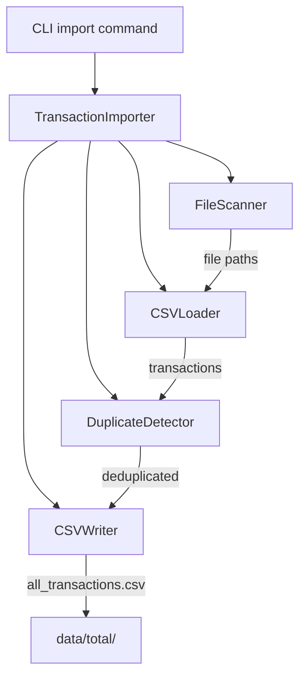

# Design Document: Transaction Import

## Overview

The Transaction Import module provides functionality to consolidate all processed transaction CSV files from institution-specific directories into a single unified file. It leverages the existing `DuplicateDetector` for deduplication logic and integrates with the CLI as a new `import` subcommand.

## Architecture



The import process follows a pipeline:
1. **Scan**: Find all CSV files in `data/{institution}/` directories
2. **Load**: Parse each CSV into Transaction objects with validation
3. **Deduplicate**: Use existing DuplicateDetector with fuzzy matching
4. **Write**: Output consolidated, sorted transactions to single CSV

## Components and Interfaces

### TransactionImporter

Main orchestrator class that coordinates the import pipeline.

```python
class TransactionImporter:
    def __init__(self, data_directory: str = "data", 
                 output_directory: str = "data/total"):
        """Initialize importer with source and output directories."""
        
    def import_all(self) -> ImportResult:
        """
        Execute full import pipeline.
        
        Returns:
            ImportResult with statistics and status
        
        Raises:
            ImportError: If any file cannot be processed
        """
        
    def scan_source_files(self) -> List[Path]:
        """
        Find all CSV files in data subdirectories.
        Excludes data/total/ and data/processed/.
        """
        
    def load_transactions(self, file_path: Path) -> List[Transaction]:
        """
        Load and validate transactions from a single CSV file.
        
        Raises:
            ImportError: If file is invalid or contains bad data
        """
        
    def validate_csv_structure(self, file_path: Path) -> bool:
        """Check that CSV has required columns."""
```

### ImportResult

Data class for import operation results.

```python
@dataclass
class ImportResult:
    success: bool
    source_files_count: int
    total_input_transactions: int
    duplicates_removed: int
    final_transaction_count: int
    output_file: str
    errors: List[str]
    warnings: List[str]
```

### ImportError

Custom exception for import failures with context.

```python
class ImportError(Exception):
    def __init__(self, message: str, file_path: Optional[str] = None,
                 line_number: Optional[int] = None, field: Optional[str] = None):
        """Create import error with optional context."""
```

## Data Models

The module uses existing data models from `models/core.py`:

- **Transaction**: Core transaction data structure with date, amount, description, account, institution, transaction_id, category, balance
- **EnrichedTransaction**: Extended transaction with account_name and account_type

### CSV Column Mapping

| CSV Column | Transaction Field | Type | Required |
|------------|------------------|------|----------|
| date | date | datetime | Yes |
| amount | amount | Decimal | Yes |
| description | description | str | Yes |
| account | account | str | Yes |
| account_name | (enriched) | str | Yes |
| account_type | (enriched) | str | Yes |
| institution | institution | str | Yes |
| transaction_id | transaction_id | str | No |
| category | category | str | No |
| balance | balance | Decimal | No |


## Correctness Properties

*A property is a characteristic or behavior that should hold true across all valid executions of a system—essentially, a formal statement about what the system should do. Properties serve as the bridge between human-readable specifications and machine-verifiable correctness guarantees.*

### Property 1: File Scanner Completeness

*For any* directory structure under `data/` containing CSV files in institution subdirectories, the scanner SHALL find all CSV files except those in `data/total/` and `data/processed/`.

**Validates: Requirements 1.1, 1.4**

### Property 2: Column Validation Correctness

*For any* CSV file, the validator SHALL accept it if and only if it contains all required columns (date, amount, description, account, account_name, account_type, institution).

**Validates: Requirements 1.2, 1.3**

### Property 3: Transaction Round-Trip Consistency

*For any* valid Transaction object, serializing it to CSV format and parsing it back SHALL produce an equivalent Transaction object.

**Validates: Requirements 1.5**

### Property 4: Signature Determinism

*For any* Transaction, generating its signature multiple times SHALL always produce the same result. Additionally, two transactions with the same amount, normalized description, and account SHALL produce the same signature.

**Validates: Requirements 2.1, 2.5**

### Property 5: Duplicate Detection Accuracy

*For any* two transactions with the same signature and dates within 3 days of each other, the deduplicator SHALL identify them as duplicates. Conversely, transactions with different signatures or dates more than 3 days apart SHALL NOT be considered duplicates.

**Validates: Requirements 2.2**

### Property 6: Merge Data Preservation

*For any* set of duplicate transactions being merged:
- If any transaction has a transaction_id, the merged result SHALL have that transaction_id
- If any transaction has a category, the merged result SHALL have a category
- If any transaction has a balance, the merged result SHALL have a balance

**Validates: Requirements 2.3, 2.4**

### Property 7: Output Format Correctness

*For any* successful import operation, the output CSV SHALL contain exactly the columns: date, amount, description, account, account_name, account_type, institution, transaction_id, category, balance. Furthermore, transactions SHALL be sorted by date in ascending order.

**Validates: Requirements 3.3, 3.4**

### Property 8: Statistics Arithmetic Consistency

*For any* import operation, the reported statistics SHALL satisfy: `final_transaction_count = total_input_transactions - duplicates_removed`.

**Validates: Requirements 3.5**

## Error Handling

### Error Categories

1. **File System Errors**
   - Directory not found or not accessible
   - Cannot create output directory
   - Cannot write output file

2. **Parse Errors**
   - Missing required columns in CSV
   - Malformed date values
   - Non-numeric amount values
   - Invalid CSV structure

3. **Data Errors**
   - Empty transaction description
   - Missing account identifier

### Error Response Strategy

All errors result in immediate failure with descriptive context:

```python
class ImportError(Exception):
    """Import operation failure with context."""
    
    def __init__(self, message: str, 
                 file_path: Optional[str] = None,
                 line_number: Optional[int] = None,
                 field: Optional[str] = None):
        self.file_path = file_path
        self.line_number = line_number
        self.field = field
        
        context_parts = []
        if file_path:
            context_parts.append(f"file: {file_path}")
        if line_number:
            context_parts.append(f"line: {line_number}")
        if field:
            context_parts.append(f"field: {field}")
            
        context = f" ({', '.join(context_parts)})" if context_parts else ""
        super().__init__(f"{message}{context}")
```

## Testing Strategy

### Unit Tests

Unit tests verify specific examples and edge cases:

- CSV with missing columns raises appropriate error
- CSV with malformed dates raises error with line number
- Empty data directory produces empty result
- Files in excluded directories are not processed
- CLI returns non-zero exit code on error

### Property-Based Tests

Property-based tests use the `hypothesis` library to verify universal properties across generated inputs:

- **Minimum 100 iterations** per property test
- Each test tagged with: `Feature: transaction-import, Property N: {property_text}`

Test configuration:
```python
from hypothesis import given, settings, strategies as st

@settings(max_examples=100)
@given(...)
def test_property_name():
    """Feature: transaction-import, Property N: description"""
    ...
```

### Test Data Generators

```python
# Generate valid transaction data
@st.composite
def transaction_strategy(draw):
    return Transaction(
        date=draw(st.datetimes(min_value=datetime(2020, 1, 1))),
        amount=draw(st.decimals(min_value=-10000, max_value=10000, places=2)),
        description=draw(st.text(min_size=1, max_size=100)),
        account=draw(st.text(min_size=1, max_size=20)),
        institution=draw(st.sampled_from(["chase", "firsttech", "apple"])),
        transaction_id=draw(st.one_of(st.none(), st.text(min_size=10, max_size=30))),
        category=draw(st.one_of(st.none(), st.text(min_size=1, max_size=50))),
        balance=draw(st.one_of(st.none(), st.decimals(places=2)))
    )
```
